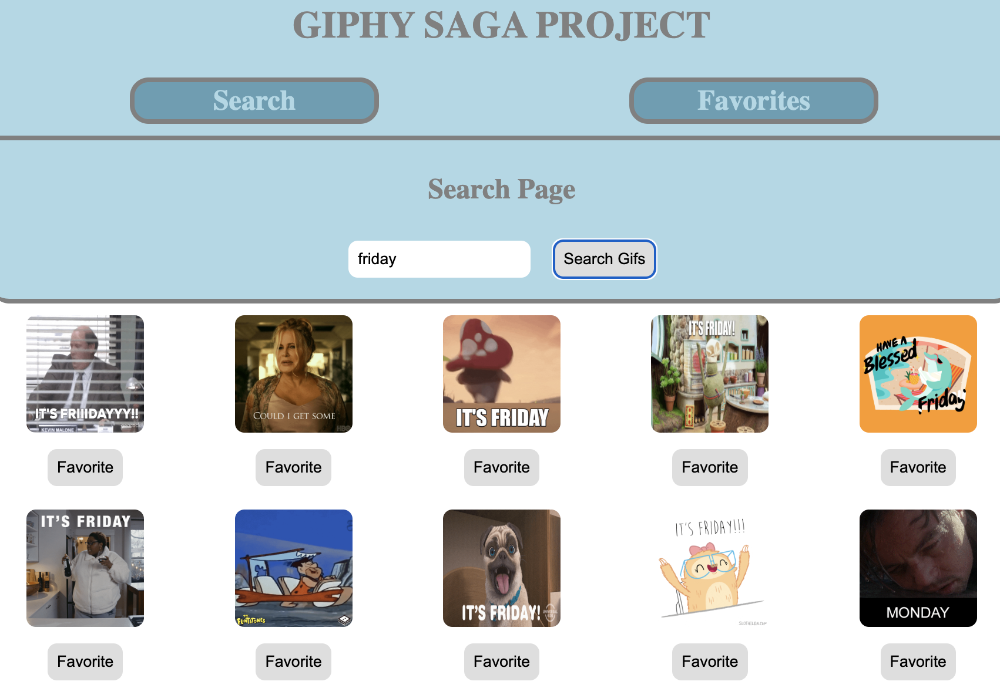
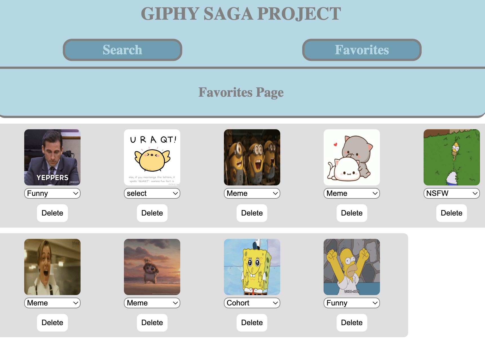

# GIPHY SAGA PROJECT 

## Description

_Duration: 1.5 days Sprint_

This Giphy application uses the Giphy API to allow users to search for and favorite Giphy images. The application has two main views: Search View and Favorites View.

In the Search View, the user can enter a search string and submit a search request. The application will then query the Giphy API Search Endpoint with the given search string from the server and display the results on the DOM. The user can then favorite any of the resulting images by clicking a button, and the minimum required information for showing the image again will be saved to the database.

In the Favorites View, the user can see all of the Giphy images they have favorited. The actual images will appear on the DOM. The user can set a category for a favorite image, and each favorite image can only have one category at a time. The category needs to be one of the categories in the database. The user can also delete any favorite image(s) they no longer want to keep.

Overall, this application allows users to easily search for and save their favorite Giphy images with the ability to categorize them for easy organization.

---
## **TABLE OF CONTENT:**
1. [Screenshot of application](#screenshot-of-application)
1. [Installation & Setup](#installation--setup)
1. [Usage](#usage)
1. [Technologies utilization](#technologies-utilization)
1. [Contributors](#contributors)
1. [Acknowledgement](#acknowledgement)

---
## Screenshots of application
### search page:

### favorites page:

---

## Installation & Setup
1. $ git clone git@github.com:nolenlawton/group-giphy-saga-project.git
1. `npm install`
1. Start postgres using brew services start postgresql (database name: `giphy_search_favorites`)
1. `npm run server` in your terminal
1. `npm run client` in another terminal. 
1. Navigate to localhost:3000

---

## Usage

### *Search View*

1. Enter a search string into the search input field.
1. Click on the search button or press 'Enter' on keyboard to submit the search request.
1. The search results will be displayed on the DOM.
1. To favorite an image, click on the 'Favorite' button of the specific image.

### *Favorites View*
1. Click on the "Favorites" link in the top navigation bar to go to the Favorites View.
1. All favorited images will be displayed on the DOM.
1. To set a category for a favorite image, click on the "Select a category" drop-down for the specific image. Choose a category from the available categories in the dropdown menu.
1. Each favorite image can only have one category at a time.
1. To delete a favorite image, click on the "Delete" button for the specific image.
---

## Technologies utilization 

* Javascript
* HTML
* CSS
* [React](https://reactjs.org/)
* [React Router v5](https://v5.reactrouter.com/web/guides/quick-start)
* [Redux](https://redux.js.org/)
* [Redux-Saga](https://redux-saga.js.org/)
* [Node js](https://nodejs.org/en/about/)
* [Express js](https://expressjs.com/)
* [Axio](https://axio.com/)
* [Postico 2](https://eggerapps.at/postico2/)
* [PostgreSQL](https://www.postgresql.org/)
* [Postman](https://www.postman.com/)
* [GitHub](https://github.com/xaihang/) 

---
## Contributors:

* [Nolen](https://github.com/nolenlawton)
* [Cyril](https://github.com/qrl666)
* [Zak](https://github.com/Zabdi94)
* [Xai](https://github.com/xaihang)

## Acknowledgement
Prime Academy and our instructors Dane and Vlada for their support and guidances. 

